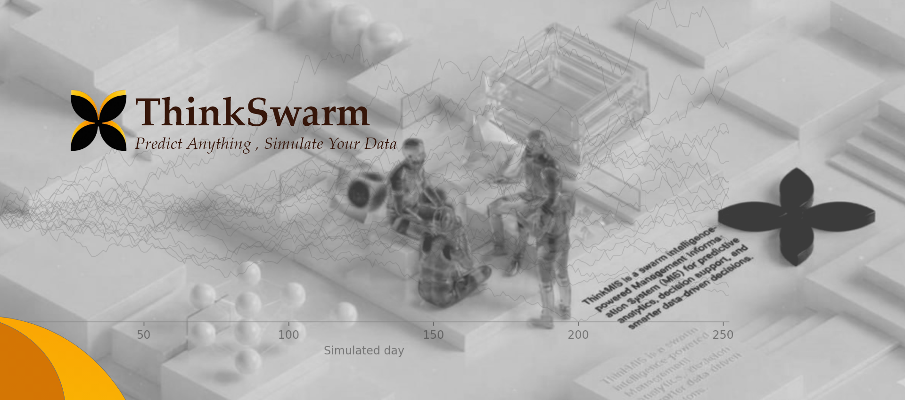

**ThinkSwarm** is an intelligent, open-source Management Information System (MIS) powered by multi-agent swarm intelligence, specifically engineered for deep company analysis, financial forecasting, and ERPNext project management. It transforms complex organizational data into actionable insights through predictive analytics, decision support, and process optimization. Designed to be simple, scalable, and adaptable, ThinkSwarm helps organizations analyze operations, accurately predict annual income, and ensure the success of ERPNext implementations.

<div align="center">



<a href="https://trendshift.io/repositories/16144" target="_blank"></a>

A Simple and Universal Swarm Intelligence Engine, Predicting Anything
</br>
<em>Transforming Data into Actionable Insights for Enterprise Analysis & ERPNext Management</em>


[](https://github.com/abeldirectory252/ThinkSwarm/stargazers)
[](https://github.com/abeldirectory252/ThinkSwarm/watchers)
[](https://github.com/abeldirectory252/ThinkSwarm/network)
[](https://hub.docker.com/)
[](https://deepwiki.com/abeldirectory252/ThinkSwarm)

[](http://discord.gg/ePf5aPaHnA)
[](https://x.com/ThinkSwarm_ai)
[](https://www.instagram.com/ThinkSwarm_ai/)

[English](./README.md)

</div>

## ⚡ Overview

**ThinkSwarm** is a next-generation AI-powered Management Information System that leverages multi-agent technology to revolutionize company analysis, financial forecasting, and ERPNext project management. By extracting seed information from your organization's real-world data (such as historical financials, market trends, ERPNext project logs, and operational metrics), it automatically constructs a high-fidelity parallel digital twin of your business.

Within this interactive sandbox, thousands of intelligent agents representing departments, stakeholders, market forces, and system users freely interact and undergo operational evolution. Decision-makers can inject variables dynamically from a "God's-eye view" to precisely deduce future trajectories — **rehearse the future in a digital sandbox, and win decisions after countless simulations**.

> **You only need to:** Upload seed materials (financial statements, ERPNext data exports, or operational reports) and describe your analysis or prediction requirements in natural language.</br>
> **ThinkSwarm will return:** A detailed annual income prediction report, a comprehensive company health analysis, and an interactive digital environment to manage your ERPNext projects.

### Our Vision

ThinkSwarm is dedicated to creating a swarm intelligence mirror that maps your enterprise reality. By capturing the collective emergence triggered by individual interactions, we break through the limitations of traditional MIS and predictive models:

- **At the Macro Level (Finance & Strategy)**: We serve as an intelligent rehearsal laboratory for executives and analysts. Predict annual income, simulate market shifts, and evaluate the financial impact of strategic decisions at zero risk.
- **At the Micro Level (ERPNext Project Management)**: We act as an AI-driven project manager for ERPNext. Simulate project workflows, identify operational bottlenecks, optimize task allocations, and ensure smooth system adoption across your organization.

From serious financial forecasting to complex ERP implementation management, we let every "what if" see its outcome, making it possible to predict and optimize any business scenario.

## 🌐 Live Demo

Welcome to visit our online demo environment and experience a prediction simulation on corporate financial forecasting and ERPNext project tracking: [ThinkSwarm-live-demo](https://abeldirectory252.github.io/ThinkSwarm/)

## 📸 Screenshots

<div align="center">
<table>
<tr>
<td></td>
<td></td>
</tr>
<tr>
<td></td>
<td></td>
</tr>
<tr>
<td></td>
<td></td>
</tr>
</table>
</div>

## 🎬 Use Case Demonstrations

### 1. Company Annual Income Prediction & Financial Analysis
<div align="center">

</div>
Experience how ThinkSwarm analyzes historical financial data, market signals, and operational metrics to simulate future market conditions, model revenue streams, and accurately predict annual income.

### 2. ERPNext Project Management & Implementation Simulation
<div align="center">

</div>
See ThinkSwarm in action as an intelligent project manager for ERPNext. Watch it simulate project workflows, identify potential bottlenecks in system adoption, and optimize resource allocation across different departments to ensure on-time delivery.

> **Supply Chain Optimization**, **HR & Payroll Simulation**, and more enterprise MIS examples coming soon...

## 🔄 Workflow

1. **Data Ingestion & Graph Building**: Seed extraction (financial reports, ERPNext databases, market analysis) & Organizational memory injection & GraphRAG construction.
2. **Environment Setup**: Entity relationship extraction (departments, roles, market forces) & Persona generation (simulating employees, managers, customers) & Agent configuration injection.
3. **Parallel Simulation**: Simulating daily business operations, ERPNext project execution, and market reactions & Dynamic temporal memory updates.
4. **Insight & Report Generation**: ReportAgent utilizes a rich toolset to analyze the simulated environment, generating highly accurate annual income predictions and ERPNext project health reports.
5. **Deep Interaction & Decision Support**: Chat with any simulated agent (e.g., department heads, ERPNext users) & Interact with the ReportAgent for strategic financial and operational decision support.

## 🚀 Quick Start

### Option 1: Source Code Deployment (Recommended)

#### Prerequisites

| Tool | Version | Description | Check Installation |
|------|---------|-------------|-------------------|
| **Node.js** | 18+ | Frontend runtime, includes npm | `node -v` |
| **Python** | ≥3.10, ≤3.12 | Backend runtime | `python --version` |
| **uv** | Latest | Python package manager | `uv --version` |

#### 1. Configure Environment Variables

```bash
# Copy the example configuration file
cp .env.example .env

# Edit the .env file and fill in the required API keys
```

**Required Environment Variables:**

```env
# LLM API Configuration (supports any LLM API with OpenAI SDK format)
# Recommended: Alibaba Qwen-plus model via Bailian Platform: https://bailian.console.aliyun.com/
# High consumption, try simulations with fewer than 40 rounds first
LLM_API_KEY=your_api_key
LLM_BASE_URL=https://dashscope.aliyuncs.com/compatible-mode/v1
LLM_MODEL_NAME=qwen-plus

# Zep Cloud Configuration
# Free monthly quota is sufficient for simple usage: https://app.getzep.com/
ZEP_API_KEY=your_zep_api_key
```

#### 2. Install Dependencies

```bash
# One-click installation of all dependencies (root + frontend + backend)
npm run setup:all
```

Or install step by step:

```bash
# Install Node dependencies (root + frontend)
npm run setup

# Install Python dependencies (backend, auto-creates virtual environment)
npm run setup:backend
```

#### 3. Start Services

```bash
# Start both frontend and backend (run from project root)
npm run dev
```

**Service URLs:**
- Frontend: `http://localhost:3000`
- Backend API: `http://localhost:5001`

**Start Individually:**

```bash
npm run backend   # Start backend only
npm run frontend  # Start frontend only
```

### Option 2: Docker Deployment

```bash
# 1. Configure environment variables (same as source deployment)
cp .env.example .env

# 2. Pull image and start
docker compose up -d
```

Reads `.env` from root directory by default, maps ports `3000 (frontend) / 5001 (backend)`

> Mirror address for faster pulling is provided as comments in `docker-compose.yml`, replace if needed.

## 📬 Join the Conversation

<div align="center">

</div>

&nbsp;

The ThinkSwarm team is recruiting full-time/internship positions. If you're interested in multi-agent simulation, financial modeling, and ERPNext integrations, feel free to send your resume to: **ThinkSwarm@shanda.com**

## 📄 Acknowledgments

**ThinkSwarm has received strategic support and incubation from Shanda Group!**

ThinkSwarm's core simulation engine is powered by **[OASIS (Open Agent Social Interaction Simulations)](https://github.com/camel-ai/oasis)**. We sincerely thank the CAMEL-AI team for their outstanding open-source contributions!

## 📈 Project Statistics

<a href="https://www.star-history.com/#abeldirectory252/ThinkSwarm&type=date&legend=top-left">
 <picture>
   <source media="(prefers-color-scheme: dark)" srcset="https://api.star-history.com/svg?repos=abeldirectory252/ThinkSwarm&type=date&theme=dark&legend=top-left" />
   <source media="(prefers-color-scheme: light)" srcset="https://api.star-history.com/svg?repos=abeldirectory252/ThinkSwarm&type=date&legend=top-left" />
   
 </picture>
</a>